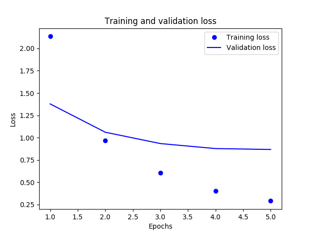

# Spain
Neural Network implementation using Python3 and Keras.
This app predicts the topic of any given text.


## References:
- [Keras Tutorial](https://towardsdatascience.com/text-classification-in-keras-part-1-a-simple-reuters-news-classifier-9558d34d01d3
)
- [Saving Keras Model](https://machinelearningmastery.com/save-load-keras-deep-learning-models/)
- [How to make predictions with Keras](https://machinelearningmastery.com/how-to-make-classification-and-regression-predictions-for-deep-learning-models-in-keras/)
- [Persisting the Tokenizer](https://intellipaat.com/community/491/keras-text-preprocessing-saving-tokenizer-object-to-file-for-scoring)
- [Predicting a new text](https://github.com/fchollet/deep-learning-with-python-notebooks/blob/master/3.6-classifying-newswires.ipynb)
- [Tagging Text with SpaCy](https://spacy.io/)
- [Named Entity Recognition with SpaCy](https://medium.com/@manivannan_data/spacy-named-entity-recognizer-4a1eeee1d749)
- [Tagging People in a Text using NLTK](https://stackoverflow.com/questions/31836058/nltk-named-entity-recognition-to-a-python-list)

## Performance


## Instructions

### Setup
Install the virtual environment.
```bash
virtualenv -p python3 .env
source .env/bin/activate
```
Download the SpaCy assets:
```bash
python3 -m spacy download en_core_web_sm
```
Download the NLTK assets in Python3:
```bash
python3
>>> import nltk
>>> nltk.download('averaged_perceptron_tagger')
>>> nltk.download('maxent_ne_chunker')
>>> nltk.download('words')
```

### Training
Execute the AI script to generate a prediction model:
```bash
python3 barcelona.py
```
The results will be available in the [models](./models) directory.  
It will generate something like this, depending on the accuracy of the model:
```bash
total 20144
-rw-rw-r--. 1 martin martin    23530 Jul 26 11:32 8036_loss.png
-rw-rw-r--. 1 martin martin     1464 Jul 26 11:32 8036_model.json
-rw-rw-r--. 1 martin martin      340 Jul 26 11:32 8036_tokenizer.pkl
-rw-rw-r--. 1 martin martin 20591008 Jul 26 11:32 8036_weights.h5
```

### Predicting
Execute the AI script to make a prediction:
```bash
python3 valencia.py 8036 "https://www.google.com/"
```
Pages will be cached in the [html](./html) directory.  
The results will be available in the [predictions](./predictions) directory.  
You should get something like this:
```bash
[http://www.ritualroasters.com/]
- trade: 0.41248124837875366
- acq: 0.30653807520866394
- earn: 0.038371115922927856
- crude: 0.03154604882001877
- grain: 0.018684780225157738
- sugar: 0.018534166738390923
- gold: 0.01808004267513752
- oilseed: 0.016360409557819366
- iron-steel: 0.013791962526738644
```

### Reporting
You may then generate a report using this script:
```bash
python3 madrid.py
```
The report will be available [here](./madrid.txt).
You should get something like this:
```bash
earn                           38.361453718389384
acq                            34.587682721205056
crude                          18.83673484873725
trade                          15.535725293913856
money-fx                       13.984338306530844
grain                          11.18527954226738
interest                       9.084325119925381
money-supply                   9.010869763735172
gold                           8.119331130597857
sugar                          7.211435533587974
ship                           6.974526333682661
iron-steel                     5.547392673016134
veg-oil                        4.8764860030807995
coffee                         4.831025702154307
oilseed                        4.789484838039357
alum                           4.269960268394243
gnp                            3.981431390200214
cocoa                          3.7983843745259946
livestock                      3.5788306686857254
nat-gas                        3.576755495977153
copper                         3.3934220579899375
pet-chem                       3.3497709334728114
dlr                            3.1494750245119576
retail                         3.1449138861736685
bop                            2.8899656720278983
wheat                          2.8252493076878693
gas                            2.795564294402169
rubber                         2.596619936530459
cotton                         2.590650792382064
zinc                           2.5218286994399364
reserves                       2.5131659550810355
cpi                            2.5010066045738206
strategic-metal                2.448736981924583
ipi                            2.4057771136188393
carcass                        2.39828788321924
meal-feed                      2.158113595559101
housing                        1.932318249250967
wpi                            1.863251338560076
orange                         1.8573605497122507
silver                         1.80249216449441
jobs                           1.5989608104282524
tin                            1.5801639761332567
lead                           1.3870372144665453
heat                           0.9079439609377005
lei                            0.6925697499100352
hog                            0.07541329646483064
```
